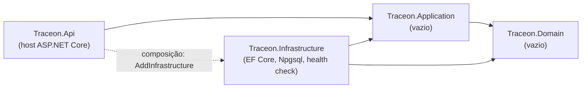

# Arquitetura do Traceon (estado da Foundation)

Este documento descreve o que **existe hoje**, mais o que as ADRs já decidiram para as próximas etapas.
O que está planejado e não implementado é marcado como tal. Decisões: [ADR 0001](adr/0001-clean-architecture-monolito-modular.md)
e [ADR 0002](adr/0002-catalogo-de-design-patterns.md); convenções de API e segurança em
[ADR 0007](adr/0007-convencoes-de-api-e-seguranca-da-foundation.md) e ameaças em
[security/threat-model.md](security/threat-model.md).

## Projetos e regra da dependência

Monólito modular com Clean Architecture pragmática: quatro projetos de código, referências só para dentro.



| Projeto | Papel hoje | Dependências |
|---|---|---|
| `Traceon.Domain` | Vazio: não há regra de negócio nem entidade | Nenhuma (nem pacote, nem framework) |
| `Traceon.Application` | Vazio: casos de uso virão com a etapa 2 | `Domain` |
| `Traceon.Infrastructure` | `TraceonDbContext` (sem `DbSet`), `DatabaseOptions`, `DatabaseHealthCheck`, `AddInfrastructure` | `Application`, `Domain`; pacotes `Npgsql.EntityFrameworkCore.PostgreSQL` e `Microsoft.Extensions.Diagnostics.HealthChecks` |
| `Traceon.Api` | `Program.cs` (composition root), `Health/` (endpoints e DTOs de resposta), `Http/SecurityHeaders`, `OpenApi/` (metadados do documento) | `Application`, `Infrastructure` (só composição) |

- Os tipos da `Infrastructure` são `internal`; a `Api` enxerga apenas os métodos de extensão públicos
  (`AddInfrastructure`, `AddDatabaseHealthCheck`). O compilador impede o uso do resto.
- A regra é verificada por testes que leem os `.csproj` (`DependencyRuleTests`, ver [ADR 0005](adr/0005-estrategia-de-testes.md)):
  `Domain` sem referências; `Application` só com `Domain`; `Infrastructure` sem ASP.NET Core; nenhum projeto
  interno referencia a `Api`.
- Critérios globais: `Directory.Build.props` liga nullable, analyzers (`AnalysisLevel` `latest-recommended`),
  `EnforceCodeStyleInBuild` e `TreatWarningsAsErrors`.

## Módulos planejados

Identity & Organizations, Sites, Monitoring, Integrity, Findings, Notifications e Audit. **Nenhum existe ainda.**
Quando existirem serão **namespaces/pastas** dentro de cada projeto (`Traceon.Domain.Sites`,
`Traceon.Application.Sites`, ...), com estas regras (ADR 0001):

- Um módulo não usa entidades nem tabelas de outro; a comunicação passa pelo serviço de aplicação do dono.
- Um `TraceonDbContext` e um schema PostgreSQL por módulo, só quando houver tabelas.
- Não são microserviços; não se criam projetos vazios por módulo.

## Fluxo das requisições de health

O navegador fala só com o servidor do Vite; o Vite encaminha apenas `/health/*` para a API (sem CORS).

```mermaid
sequenceDiagram
    participant B as Navegador (React)
    participant V as Vite (:5173, proxy /health)
    participant A as API (:5120)
    participant P as PostgreSQL (127.0.0.1:5432)
    Note over A: toda resposta leva headers de segurança; as de health, Cache-Control: no-store
    B->>V: GET /health/live e GET /health/ready (em paralelo, timeout de 5 s)
    V->>A: encaminha
    A-->>V: live: 200 {"status":"Healthy"} (sem consultar o banco)
    A->>P: ready: abre conexão própria, sem pool, timeout de 3 s
    alt conexão aberta
        P-->>A: ok
        A-->>V: 200 {"status":"Healthy","checks":[{"name":"database","status":"Healthy"}]}
    else recusa, silêncio ou timeout
        A-->>V: 503 {"status":"Unhealthy","checks":[{"name":"database","status":"Unhealthy"}]}
    end
    V-->>B: resposta (502 do proxy se a API estiver parada)
    B->>B: parse do contrato e estado: operacional / banco indisponível / API sem resposta / resposta inesperada
```

Como o frontend interpreta (`frontend/src/status/systemStatus.ts`): 5xx ou falha de rede em `live` significa
"API não responde" (sem a API, o proxy responde 502); `live` saudável com `ready` 503 e check `database`
`Unhealthy` significa "banco indisponível"; qualquer corpo fora do contrato ou status inesperado vira
"resposta inesperada". A tabela completa está em [frontend/README.md](../frontend/README.md).

## Pipeline HTTP

Ordem em `Program.cs`: `UseSecurityHeaders` → `UseExceptionHandler` → `UseStatusCodePages` → `MapOpenApi` (só
Development) → `MapHealthEndpoints`.

- **`SecurityHeaders`** (`Http/`): `X-Content-Type-Options`, `Referrer-Policy`, `X-Frame-Options` e CSP
  `default-src 'none'; frame-ancestors 'none'` em toda resposta, inclusive 404, 405 e 500. São gravados em
  `Response.OnStarting` porque o `UseExceptionHandler` limpa os headers antes de escrever o 500.
- **Erros:** 404, 405 e 500 saem em Problem Details; o 500 é genérico, com `traceId` (o log da exceção usa o mesmo
  id; o console liga `IncludeScopes`).
- **Inventário de rotas:** `RouteInventoryTests` compara as rotas registradas com a allowlist pública
  (`GET /health/live`, `GET /health/ready`; mais o documento OpenAPI em Development). Rota ou método novo quebra o teste
  até haver decisão.

## OpenAPI no build

- O documento é code-first: `AddOpenApi` + metadados nos endpoints (`WithName` = `operationId`, resumo, descrição,
  respostas) + `[MaxLength]`/`[RegularExpression]` nos DTOs. `OpenApi/OpenApiDocumentSetup` define título,
  descrição e `servers: [{ "url": "/" }]`.
- `Microsoft.Extensions.ApiDescription.Server` grava `docs/api/openapi.json` a cada build da API. Na geração o
  entrypoint é `GetDocument.Insider`; `Program.cs` pula só `AddInfrastructure` nesse caso, então o build não usa banco
  nem connection string.
- A spec é **versionada**: a CI falha se `git diff -- docs/api` mostrar diferença e roda Spectral + ruleset OWASP
  (`.spectral.yaml`) no job `api-spec`. Quem muda contrato commita a spec. Decisão e alternativas: ADR 0007.

## Health checks

- `/health/live` e `/health/ready` são `MapGet` (só GET; outros métodos → 405 Problem Details com `Allow: GET`)
  que consultam o `HealthCheckService` e devolvem DTOs tipados.
- `/health/live` roda **nenhum** check (`CheckHealthAsync(_ => false)`): um banco fora do ar não deve fazer um
  orquestrador reiniciar um processo saudável.
- `/health/ready` roda os checks com a tag `ready` (hoje, `database`); `Unhealthy` vira 503 no próprio endpoint e
  `Degraded` continua 200.
- A sonda abre uma `NpgsqlConnection` própria, com `Pooling=false` e `Timeout=3 s`, em vez de usar o
  `DbContext`/pool: o Npgsql ignora o `CancellationToken` durante o startup da conexão, e uma conexão
  reaproveitada do pool poderia declarar pronto um banco morto.
- O corpo é montado por allowlist (`LivenessResponse`, `ReadinessResponse`, `CheckResponse`): só status (como
  string) e nome do check. `Cache-Control: no-store` vem de um filtro do grupo `/health`.
- Racional completo e alternativas: [ADR 0004](adr/0004-health-checks-liveness-e-readiness.md).

## Configuração e erros

- **Connection string:** `ConnectionStrings:Traceon`, obrigatória. `DatabaseOptions` é validada com
  `ValidateOnStart` (ausente, vazia ou malformada derruba o app na partida); a mensagem nomeia a chave e nunca
  o valor. Em desenvolvimento vem de User Secrets (`UserSecretsId` no `Traceon.Api.csproj`); em outros ambientes,
  da variável `ConnectionStrings__Traceon`. Nunca vai para `appsettings*.json`.
- **Ambientes:** `launchSettings.json` (perfil `http`, porta 5120) usa `Development`; os testes usam `Testing`,
  que não lê User Secrets. OpenAPI (`/openapi/v1.json`) só em `Development`.
- **Container de DI:** `ValidateScopes` e `ValidateOnBuild` ligados em todos os ambientes.
- **EF Core:** sem logging de dados sensíveis e sem timeouts customizados (valem os padrões do Npgsql, ajustáveis
  na connection string). O `TraceonDbContext` ainda não tem entidades nem migrations.
- **Erros:** `AddProblemDetails` + `UseExceptionHandler()` + `UseStatusCodePages()`: exceções e códigos sem corpo
  viram Problem Details sem detalhe interno (testados: 404, 405 e 500 genérico com `traceId`, ver ADR 0007). O ADR 0002
  cita `IExceptionHandler`; não há implementação própria ainda porque não existem exceções de domínio a mapear.
- **Logging:** console com `IncludeScopes`, para o trace id acompanhar cada linha de log.

## Frontend

React + TypeScript + Vite + Tailwind, uma tela ("Estado do sistema"). Camadas pequenas: `api/http.ts` (único
ponto de `fetch`, corpo tratado como `unknown`, timeout e cancelamento), `status/healthContract.ts` (parse do
contrato), `status/systemStatus.ts` (regras de estado), `useSystemStatus` (hook) e componentes de apresentação.
O estado é uma união discriminada; não há biblioteca de estado, de dados nem de componentes.
Integração e configuração: [ADR 0006](adr/0006-integracao-frontend-proxy-e-configuracao.md).

## Onde o worker entrará (etapa 3, não implementado)

Um host separado, `Traceon.Worker`, que referencia `Application` e `Infrastructure` e reaproveita `AddInfrastructure`.
É um processo a mais, **sem banco próprio**: o processamento será persistente (tabela de jobs com estado, lease e
`FOR UPDATE SKIP LOCKED`), com concorrência limitada, cancelamento e isolamento do coletor Playwright (ADR 0002).
Nada disso existe na Foundation, e coleta externa só entra após autorização do site, modelo de ameaças e
controles de SSRF.

## Fora do escopo desta etapa

Autenticação, organizações, sites, entidades, migrations, jobs, notificações, auditoria, infraestrutura em nuvem
e Kubernetes. A pasta `infrastructure/` prevista no prompt mestre ainda não existe.
