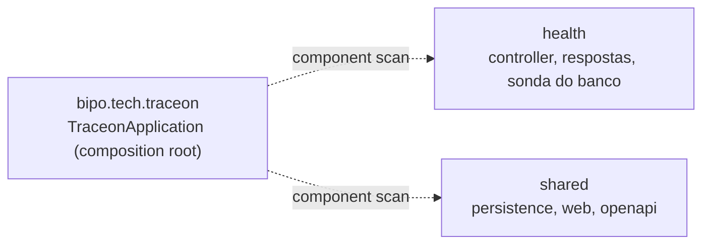

# Arquitetura do Traceon (estado da Foundation)

Este documento descreve o que **existe hoje**, mais o que as ADRs já decidiram para as próximas etapas.
O que está planejado e não implementado é marcado como tal. Decisões: [ADR 0001](adr/0001-clean-architecture-monolito-modular.md)
e [ADR 0002](adr/0002-catalogo-de-design-patterns.md); convenções de API e segurança em
[ADR 0007](adr/0007-convencoes-de-api-e-seguranca-da-foundation.md) e ameaças em
[security/threat-model.md](security/threat-model.md).

## Pacotes e regra da dependência

Backend em Java 25 e Spring Boot 4.1.1, num único módulo Maven (`backend/`). A Foundation foi escrita em .NET e
migrada ([ADR 0009](adr/0009-migracao-do-backend-para-java-e-spring-boot.md)); o comportamento e os testes são
os mesmos.



| Pacote | Papel hoje |
|---|---|
| `bipo.tech.traceon` | `TraceonApplication`: `main` e composition root (component scan dos subpacotes) |
| `health` | `HealthController` (`/health/live`, `/health/ready`), respostas (`LivenessResponse`, `ReadinessResponse`, `CheckResponse`, `HealthStatus`), `DatabaseProbe`, `HealthApiDocumentation` |
| `shared.persistence` | `DataSourceConfiguration` (pool Hikari com validação de `spring.datasource.url` na partida) |
| `shared.web` | `SecurityHeadersFilter`, `UnhandledExceptionLoggingFilter`, `ProblemDetailErrorController`, registro dos filtros |
| `shared.openapi` | Metadados do documento e o 500 em Problem Details em toda operação |

- Tudo é `package-private`, salvo o `main`: nenhum pacote usa classe de outro; a composição é do Spring.
- Os módulos de negócio serão pacotes irmãos (`identity`, `sites`, ...), cada um com `domain` → nada;
  `application` → `domain`; `infrastructure` → `application`/`domain`; `api` → `application`.
- Verificação (fitness functions, ADR 0001): `ArchitectureTest` (ArchUnit: pacote de módulo planejado, as três
  regras de camada) e `ModularityTest` (Spring Modulith: sem ciclos e sem acesso aos subpacotes internos de outro
  módulo). A regra não é do compilador, como era com os projetos .NET: `package-private` é a primeira barreira.
- Critérios globais: `-Xlint:all` com falha em aviso, Spotless (Palantir Java Format) e `dependency:analyze` no
  `verify`.

## Módulos planejados

Identity & Organizations, Sites, Monitoring, Integrity, Findings, Notifications e Audit. **Nenhum existe ainda**, e
não se criam pacotes vazios para eles. Regras (ADR 0001):

- Um módulo não usa entidades nem tabelas de outro; a comunicação passa pela API do pacote raiz do dono.
- Um `DataSource` e um schema PostgreSQL por módulo, só quando houver tabelas.
- Não são microserviços.

## Fluxo das requisições de health

O navegador fala só com o servidor do Vite; o Vite encaminha apenas `/health/*` para a API (sem CORS).

```mermaid
sequenceDiagram
    participant B as Navegador (React)
    participant V as Vite (:5173, proxy /health)
    participant A as API (:5120)
    participant P as PostgreSQL (127.0.0.1:POSTGRES_PORT)
    Note over A: toda resposta leva headers de segurança; as de health, Cache-Control: no-store
    B->>V: GET /health/live e GET /health/ready (em paralelo, timeout de 5 s)
    V->>A: encaminha
    A-->>V: live: 200 {"status":"Healthy"} (sem consultar o banco)
    A->>P: ready: abre conexão JDBC própria, sem pool, timeout de 3 s
    alt conexão aberta
        P-->>A: ok
        A-->>V: 200 {"status":"Healthy","checks":[{"name":"database","status":"Healthy"}]}
    else recusa, silêncio ou timeout
        A-->>V: 503 {"status":"Unhealthy","checks":[{"name":"database","status":"Unhealthy"}]}
    end
    V-->>B: resposta (502 do proxy se a API estiver parada)
    B->>B: parse do contrato e estado: operacional / banco indisponível / API sem resposta / resposta inesperada
```

Como o frontend interpreta (`frontend/src/status/systemStatus.ts`): 5xx ou falha de rede em `live` significa
"API não responde" (sem a API, o proxy responde 502); `live` saudável com `ready` 503 e check `database`
`Unhealthy` significa "banco indisponível"; qualquer corpo fora do contrato ou status inesperado vira
"resposta inesperada". A tabela completa está em [frontend/README.md](../frontend/README.md).

## Pipeline HTTP

Filtros, na ordem: `ServerHttpObservationFilter` do Boot (abre o trace) → `SecurityHeadersFilter` →
`UnhandledExceptionLoggingFilter` → `DispatcherServlet`.

- **Headers de segurança:** `X-Content-Type-Options`, `Referrer-Policy`, `X-Frame-Options` e CSP
  `default-src 'none'; frame-ancestors 'none'` em toda resposta, inclusive 404, 405 e 500. Gravados antes da
  cadeia, sobrevivem ao encaminhamento de erro. Com a autenticação (etapa 2) passam ao Spring Security.
- **Erros:** 404 (rota desconhecida; arquivos estáticos desligados) e 405 saem em Problem Details pelo handler do
  MVC (`spring.mvc.problemdetails.enabled`). A exceção não tratada é registrada pelo
  `UnhandledExceptionLoggingFilter` ainda dentro do trace, e o `ProblemDetailErrorController` (que substitui o
  `BasicErrorController`) responde 500 genérico com o mesmo `traceId`. `/error` chamado direto responde 404.
- **Correlação:** Micrometer Tracing com OpenTelemetry; trace id W3C em cada linha de log (ECS em JSON; texto com o
  profile `plain-logs`). Nada é exportado sem coletor configurado.
- **Inventário de rotas:** `RouteInventoryIT` compara as rotas de todos os handler mappings com a allowlist
  pública (`GET /health/live`, `GET /health/ready`, `* /error`; mais a spec em JSON e YAML no profile `api-docs`).
  Rota ou método novo quebra o teste até haver decisão.

## OpenAPI

- Code-first com springdoc: `@Operation`/`@ApiResponse` no controller, `@Schema` nas respostas e dois
  `OpenApiCustomizer` (`Cache-Control` das respostas de health; 500 e schema `ProblemDetail` em toda operação).
- A spec só é servida com o profile `api-docs`, em `/openapi/v1.json`; a configuração padrão é a de produção.
- `OpenApiDocumentIT` gera a spec, grava `backend/target/openapi.json` e falha se `docs/api/openapi.json` divergir.
  A CI roda Spectral + ruleset OWASP sobre a versionada (`.spectral.yaml`). Decisão e alternativas: ADR 0007.

## Health checks

- `HealthController` com `@GetMapping` (só GET; outros métodos → 405 Problem Details com `Allow: GET`) e respostas
  em `record`, montadas por allowlist: só status (como string) e nome do check. `Cache-Control: no-store` em toda
  resposta de health.
- `/health/live` não executa **nenhuma** verificação: um banco fora do ar não deve fazer um orquestrador reiniciar
  um processo saudável.
- `/health/ready` roda a sonda do banco; o estado geral é o pior entre as verificações. `Unhealthy` vira 503 e
  `Degraded` continua 200.
- `DatabaseProbe` abre uma conexão JDBC própria, fora do pool, com `loginTimeout`, `connectTimeout` e
  `socketTimeout` de 3 s: uma conexão reaproveitada do pool poderia declarar pronto um banco morto, e o
  `loginTimeout` cobre o servidor que aceita o TCP e fica mudo. A falha vai para o log só com a mensagem do driver.
- Racional completo e alternativas: [ADR 0004](adr/0004-health-checks-liveness-e-readiness.md).

## Configuração e persistência

- **Banco:** `SPRING_DATASOURCE_URL` (JDBC, sem senha), `SPRING_DATASOURCE_USERNAME` e `SPRING_DATASOURCE_PASSWORD`.
  `DataSourceConfiguration` derruba a partida se a URL faltar ou o parser do driver não a aceitar, com mensagem que
  nomeia a chave e nunca o valor (a validação do binder do Boot repetiria o valor no log). Em desenvolvimento as
  variáveis vêm do `.env` carregado no shell; nunca de arquivo versionado.
- **Partida sem banco:** o pool só conecta no primeiro uso, o Hibernate não lê metadados na subida (dialeto e versão
  do PostgreSQL vêm da configuração) e `ddl-auto=none`. A aplicação sobe com o banco fora do ar.
- **JPA e Flyway:** configurados, sem entidades nem migrations. `open-in-view` desligado. O Flyway nunca roda na
  partida (`spring.flyway.enabled=false`, ADR 0008); as migrations serão aplicadas por comando explícito.
- **Profiles:** `api-docs` (spec) e `plain-logs` (log em texto), nomeados pela função, nunca pelo ambiente. Porta
  5120, a mesma da API .NET, para o proxy do Vite.
- **Threads:** virtual threads ligadas.

## Frontend

React + TypeScript + Vite + Tailwind, uma tela ("Estado do sistema"). Camadas pequenas: `api/http.ts` (único
ponto de `fetch`, corpo tratado como `unknown`, timeout e cancelamento), `status/healthContract.ts` (parse do
contrato), `status/systemStatus.ts` (regras de estado), `useSystemStatus` (hook) e componentes de apresentação.
O estado é uma união discriminada; não há biblioteca de estado, de dados nem de componentes.
Integração e configuração: [ADR 0006](adr/0006-integracao-frontend-proxy-e-configuracao.md).

## Onde o worker entrará (etapa 3, não implementado)

Um processo separado que reaproveita o código do mesmo módulo Maven, **sem banco próprio**: o processamento será
persistente (tabela de jobs com estado, lease e `FOR UPDATE SKIP LOCKED`), com concorrência limitada,
cancelamento e isolamento do coletor Playwright Java (ADR 0002). Nada disso existe na Foundation, e coleta externa
só entra após autorização do site, modelo de ameaças e controles de SSRF.

## Fora do escopo desta etapa

Autenticação, organizações, sites, entidades, migrations, jobs, notificações, auditoria, infraestrutura em nuvem
e Kubernetes. A pasta `infrastructure/` prevista no prompt mestre ainda não existe.
