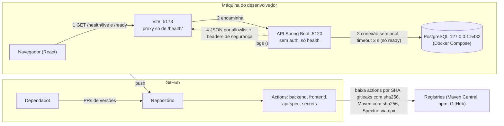
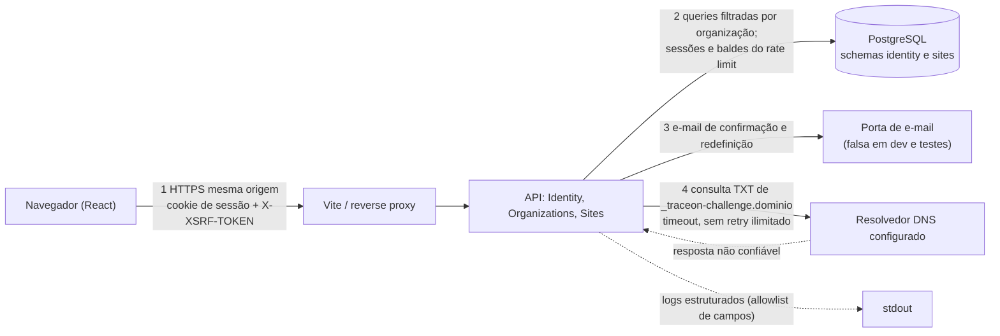

# Modelo de ameaças

- **Revisão:** 2026-10-09 (Foundation e etapa 2). Próxima revisão: no início da etapa 3 (coletor) e a cada
  trimestre.
- **Método:** inventário de dados → DFD → STRIDE → mitigação → teste que a garante (SA cap. 2.2 e 12.1, conforme
  `~/.claude/knowledge/api-security.md` §1). Regra de leitura: ameaça mitigada aponta para o **nome exato** do teste ou
  para o passo de CI; sem teste fica marcada **"sem teste — pendente"**; risco que se decidiu não tratar fica
  **"aceito"** com motivo.
- **Estado dos testes:** os da Foundation estão commitados e passam na CI. Desde a migração para Java
  ([ADR 0009](../adr/0009-migracao-do-backend-para-java-e-spring-boot.md)) os nomes são os dos testes Java (run
  37943341119 do PR #6); a paridade com os .NET originais está em [acceptance.md](../acceptance.md). Os da
  [etapa 2](#etapa-2-identity--sites) são **planejados**: os nomes fixam o comportamento exigido e cada teste entra no
  mesmo PR da mitigação; a etapa não fecha com algum deles faltando.

# Foundation

## Escopo

Superfície da Foundation, e só ela:

- API Spring Boot com `GET /health/live`, `GET /health/ready` e, só no profile `api-docs`, `GET /openapi/v1.json`
  (e a variante `.yaml`).
  Sem autenticação, sem dados de negócio, sem entidades nem migrations.
- PostgreSQL local (Docker Compose, porta publicada só em `127.0.0.1`).
- Frontend React servido pelo Vite, que encaminha apenas `/health/` para a API (sem CORS).
- Cadeia de entrega: repositório, GitHub Actions (jobs backend, frontend, api-spec e secrets) e Dependabot.

Fora do escopo da Foundation: identidade, organizações e sites (ver [etapa 2](#etapa-2-identity--sites)); coletor,
worker e nuvem (ver "Ameaças das próximas etapas").

## Inventário de dados

| Dado | Onde está | Quem vê | Observação |
|---|---|---|---|
| Dados de usuário ou de negócio | Em lugar nenhum | Ninguém | Não existem hoje: sem contas, sites, evidências nem PII |
| Senha do PostgreSQL | `.env` (Compose e, carregado no shell, a API; fora do Git) e `SPRING_DATASOURCE_PASSWORD` | Desenvolvedor; processo da API | Separada da URL; nunca em `application*.properties`, bundle, log nem resposta (testes na tabela abaixo) |
| URL JDBC (host, porta, banco) e usuário | Memória da API | Processo da API | Não saem nas respostas; a mensagem do driver (host e porta) vai ao log da falha da readiness |
| Estado de saúde (`Healthy`/`Unhealthy`, nome do check `database`) | Resposta de `/health/*` | Qualquer cliente que alcance a API | Público por design (ADR 0004); é o único dado exposto |
| Logs (console da API, JSON ECS) | stdout do processo | Quem opera o processo | Contêm o trace id e, no 500, a exceção completa (risco R3) |
| Spec OpenAPI | `docs/api/openapi.json` (Git) e `/openapi/v1.json` (profile `api-docs`) | Quem lê o repositório | Descreve só as duas rotas de health |
| Segredos de CI | Nenhum configurado | n/a | Jobs com `permissions: contents: read` e `persist-credentials: false` |

Endpoints mais sensíveis: nenhum manipula dado sensível. O mais caro é `GET /health/ready`, que abre uma conexão
real com o banco a cada chamada (risco R1).

## DFD

Fronteiras de confiança: navegador × Vite/API; API × PostgreSQL; repositório × CI × registries. Fluxos fáceis de
esquecer: o log (sai do processo), a CI (baixa código de terceiros) e a spec (mapa da superfície).

## STRIDE

Legenda da coluna "Garantia": nome de teste = `Classe.Metodo`; **CI** = passo do workflow
(`.github/workflows/ci.yml`); **revisão** = controle sem automação.

| # | Cat. | Ameaça | Mitigação | Garantia (teste ou controle) |
|---|---|---|---|---|
| 1 | I | Diagnóstico ou connection string vazam no corpo do health (descrição, exceção, host, porta, senha) | Resposta por allowlist (`LivenessResponse`, `ReadinessResponse`, `CheckResponse`): só status e nome do check | `RefusingDatabaseHealthIT` e `SilentDatabaseHealthIT`, `ready503UnhealthyPromptlyWhenDatabaseIsUnreachable` (corpo exato; canário da senha, porta, `jdbc:`, `Exception`, `postgresql` e ` at ` ausentes); `HealthEndpointIT.readyReturnsHealthyDatabaseCheckWhenDatabaseIsAvailable` e `HealthEndpointIT.liveReturnsHealthyWhenDatabaseIsAvailable` (corpo exato) |
| 2 | I | Frontend repassa campo sensível extra, caso a API o enviasse | O parse do contrato descarta campos fora dele | `healthContract.test.ts`: "keeps only the contract fields when the body has extra ones" |
| 3 | I | Erro 500 ou 404 vaza stack, SQL, classe ou connection string | Problem Details do MVC (404, 405) e `ProblemDetailErrorController` (500 genérico com `traceId`); a exceção só vai ao log | `UnhandledExceptionIT.unhandledExceptionReturnsGeneric500ProblemDetailsWithTraceId` (exceção com canário, `Host=`, `jdbc:`, ` at `, `bipo.` e `traceon.` não aparece no corpo); `HttpPipelineIT.unknownRouteReturnsProblemDetailsWithoutInternalDetails` |
| 4 | I | Configuração inválida derruba o app repetindo a URL do banco na mensagem | `DataSourceConfiguration` valida `spring.datasource.url` na partida com o parser do driver; a mensagem nomeia a chave, nunca o valor, e a exceção do parser é descartada | `DataSourceConfigurationTest.contextFailsToStartWithMalformedDatabaseUrlWithoutEchoingIt` (4 URLs com canário, inclusive a connection string do Npgsql); `DataSourceConfigurationTest.contextFailsToStartWithoutDatabaseUrl` e `contextFailsToStartWithBlankDatabaseUrl`; `TraceonApplicationTest.entryPointFailureNeverLogsTheMalformedUrl` (o `main` real; o log também não traz o valor) |
| 5 | I | Senha do banco aparece em log quando a readiness falha | A sonda loga só a mensagem do driver, que não traz a senha; nunca a URL nem as propriedades da conexão | `RefusingDatabaseHealthIT` e `SilentDatabaseHealthIT`, `readyFailureLogsNeverContainTheDatabasePassword` |
| 6 | I | Resposta de health é cacheada e mostra estado velho (ou ficaria em cache compartilhado) | `Cache-Control: no-store` em toda resposta do `HealthController` | `HealthEndpointIT.healthResponsesAreUncacheableJson`; contrato do header em `OpenApiDocumentIT.healthOperationDocumentsItsIdentityAndJsonResponses` |
| 7 | I/T | Clickjacking, MIME sniffing e referrer vazando em respostas da API | `X-Content-Type-Options: nosniff`, `Referrer-Policy: no-referrer`, `X-Frame-Options: DENY`, `Content-Security-Policy: default-src 'none'; frame-ancestors 'none'`, gravados pelo `SecurityHeadersFilter` antes da cadeia (valem também no 500 do encaminhamento de erro) | `HttpPipelineIT.responsesCarrySecurityHeaders` (live 200, ready 503, rota inexistente 404); `UnhandledExceptionIT.unhandledExceptionResponseKeepsSecurityHeaders`. **Lacuna:** a página do frontend (servida pelo Vite) não tem esses headers; fica para a hospedagem (etapa 6, ver R5) |
| 8 | S/E | Rota ou método não previstos (endpoint esquecido, `POST` em health, ghost API) | Health só em `@GetMapping`; outros métodos → 405 Problem Details com `Allow: GET`; arquivos estáticos desligados; `/error` chamado direto → 404; inventário de rotas de todos os handler mappings como fitness function; spec lista só as duas operações | `RouteInventoryIT.registeredRoutesAreExactlyThePublicAllowlist`; `OpenApiDocumentIT.apiDocsProfileAddsOnlyTheSpecRoutesToTheAllowlist`; `HealthEndpointIT.healthEndpointsRejectOtherMethodsWith405ProblemDetails`; `HttpPipelineIT.errorRouteCalledDirectlyLooksLikeAnUnknownRoute`; `OpenApiDocumentIT.documentListsExactlyTheTwoHealthGetOperations` |
| 9 | I | Spec OpenAPI exposta em produção revela a superfície | springdoc desligado por padrão; só o profile `api-docs` o liga; sem Swagger UI | `HttpPipelineIT.openApiDocumentIsNotExposedWithoutTheApiDocsProfile` |
| 10 | T | Spec versionada diverge do código (contrato muda sem revisão) | O `OpenApiDocumentIT` gera a spec e falha se `docs/api/openapi.json` divergir; a CI roda o `verify` | `OpenApiDocumentIT.committedSpecMatchesTheGeneratedOne` (job backend); lint da spec: job `api-spec` (Spectral + owasp-ruleset). Ambos passaram na CI (run 37943341119) |
| 11 | S/E | Falsa sensação de autenticação: alguém assume que a API é protegida | Não há autenticação, e nenhuma rota além de health existe; health é anônimo por design (ADR 0004); o Spectral tem `overrides` só para os dois paths de health, então rota nova sem `security` falha o lint | `RouteInventoryIT` (nenhuma rota fora da allowlist). Na etapa 2 o inventário passa a exigir 401 sem credencial (ameaça 25) |
| 12 | T | Resposta adulterada ou inesperada confundida com estado válido no painel | O frontend trata o corpo como `unknown`, valida o contrato e cai em "resposta inesperada" | `healthContract.test.ts`: "rejects %s" (13 corpos inválidos); `http.test.ts`: "reports a body that is not JSON as invalid" e "reports JSON that the parser rejects as invalid" |
| 13 | I | Banco exposto na rede | Compose publica a porta só em `127.0.0.1`; senha obrigatória, sem padrão (`${POSTGRES_PASSWORD:?...}`) | **Sem teste — pendente** (controle de configuração em `compose.yaml`, só desenvolvimento local; produção é etapa 6) |
| 14 | I | Segredo commitado (senha, URL com credencial, `.env`) | `.env` no `.gitignore` (`.env.example` sem segredo); senha do banco só em variável de ambiente, separada da URL; gitleaks sobre o histórico completo, binário com versão e sha256 fixos | CI: job `secrets` ("Procurar segredos no histórico"), passou na CI; o histórico também foi varrido antes de tornar o repositório público. Nenhum segredo em `application*.properties` por revisão |
| 15 | I | Segredo no bundle do frontend | `TRACEON_API_URL` sem prefixo `VITE_`, lida só pelo `vite.config.ts`; nenhum valor sensível no frontend (ADR 0006) | **Sem teste — pendente** (revisão; um teste do bundle é candidato quando houver segredo possível) |
| 16 | T/E | Supply chain: action, pacote ou imagem comprometidos ou trocados | Actions fixadas por SHA com a versão em comentário; dependências Maven em versão exata (BOM do Boot ou `<properties>`), wrapper do Maven com `distributionSha256Sum`; npm em versão exata (`.npmrc` `save-exact`), `npm ci`; imagem `postgres:18.6-alpine3.24` sem `latest`; `permissions: contents: read`; `persist-credentials: false`; idade mínima de 2 semanas aplicada à mão (ADR 0003); Dependabot semanal sem major | CI: `./mvnw` (falha se o sha256 da distribuição do Maven divergir), `dependency:analyze` (nada usado sem declaração), `npm ci` (falha se o lockfile divergir), checksum do gitleaks. Política de SHA e idade mínima: **revisão de PR, sem automação**. Lacunas em R4 |
| 17 | D | Abuso de `GET /health/ready`: cada chamada abre uma conexão real sem pool e pode esgotar `max_connections` ou segurar threads | Limite atual: a sonda tem timeout de 3 s e fecha a conexão; health sem dado, sem autenticação. Com virtual threads não há nem o teto do pool de threads | Timeout garantido por `SilentDatabaseHealthIT.ready503UnhealthyPromptlyWhenDatabaseIsUnreachable` (banco mudo responde 503 dentro da margem de 10 s para o limite de 3 s). **Sem rate limit: risco aceito (R1)** |
| 18 | D | Banco lento ou mudo trava a API | Timeout de 3 s na sonda; liveness não consulta o banco; a aplicação sobe sem conectar | `RefusingDatabaseHealthIT` e `SilentDatabaseHealthIT`, `liveReturnsHealthyWhenDatabaseIsUnreachable`; `DataSourceConfigurationTest.contextStartsWithAValidUrlWithoutConnecting`; teste acima para a readiness |
| 19 | R | Ação sem autoria (repudiation) | Não há ação de usuário nem de negócio; o 500 traz `traceId` e o log da exceção usa o mesmo id (Micrometer Tracing) | `UnhandledExceptionIT.unhandledExceptionIsLoggedWithTheTraceIdReturnedToTheClient`. Trilha de auditoria de ações de usuário: módulo Audit, etapa 5 |

## Riscos aceitos e pendências

| # | Risco | Situação | Decisão |
|---|---|---|---|
| R1 | DoS por chamadas repetidas a `/health/ready` (conexão real por chamada, sem pool, sem rate limit) | **Aceito na Foundation.** Mitigação parcial: timeout de 3 s. Sem limite por IP nem cache do resultado. As regras OWASP `api4:2023-rate-limit*` estão desligadas só para os paths de health no `.spectral.yaml`, com este motivo | **Decisão pendente** na etapa 2 (rate limit de login, mesma infraestrutura) e etapa 6 (limite no reverse proxy/Azure). Se health ganhar limite ou cache, as duas regras voltam para esses paths |
| R2 | Sem allowlist de `Host` (qualquer `Host` é aceito; era o `AllowedHosts: "*"` do .NET) | **Aceito:** só desenvolvimento local, sem links gerados a partir do host | Fechar na etapa 6, com o domínio real |
| R3 | O log do 500 guarda a mensagem completa da exceção (o teste de correlação semeia canário nela). Se uma exceção futura carregar segredo ou PII na mensagem, ele vai ao log | **Aceito na Foundation:** hoje não há dado sensível nem fonte de PII, e o log não sai da máquina | Revisar na etapa 2, junto com a allowlist de campos de log e o canário de vazamento em logs de requisições com dado de usuário |
| R4 | Supply chain com lacunas: (a) as versões do Spectral na CI (`SPECTRAL_CLI_VERSION`, `SPECTRAL_OWASP_RULESET_VERSION`) são exatas, mas ficam num `env:` do workflow, **fora do Dependabot**; (b) o `npx` do job `api-spec` resolve dependências transitivas do registry sem lockfile nem hash; (c) o Maven também não verifica hash das dependências (só o wrapper confere a distribuição) (ADR 0003) | **Aceito**, com atualização manual das duas versões | Reavaliar se o Spectral virar dependência do repositório (`package.json` com lockfile) |
| R5 | Headers de segurança e CSP só existem na API; o HTML do frontend não os tem. HSTS inexistente (HTTP local). `servers` por ambiente ausentes na spec. CORS × reverse proxy não decidido | **Aceito:** a hospedagem ainda não existe | Etapa 6: CSP do frontend na hospedagem, HSTS, `servers`, decisão de CORS |
| R6 | A CI, o gitleaks e o Dependabot nunca tinham rodado; os controles 10, 14 e 16 estavam configurados, não comprovados | **Resolvido em 2026-10-09:** os 4 jobs passaram no `main` e o Dependabot abriu PRs | Nenhuma |

# Etapa 2: Identity & Sites

Decisões de base: [ADR 0008](../adr/0008-identidade-organizacoes-e-comprovacao-de-sites.md). Escolhas do responsável
em 2026-10-09 que moldam esta seção: confirmação de e-mail obrigatória antes do login; `Member` lê, cadastra e
verifica sites, e só `Owner` remove site e exclui organização; o mesmo domínio pode existir em várias organizações,
cada uma com sua comprovação; a comprovação não expira nesta etapa e a etapa 3 a revalida antes de coletar.

## Escopo

Superfície nova. Os caminhos são provisórios e o contrato OpenAPI os fixa no passo seguinte:

- **Conta:** cadastro, confirmação de e-mail, login, logout, "esqueci a senha", redefinição, `GET` da própria conta e
  exclusão da conta (exige a senha atual). Token CSRF para o frontend (cookie `XSRF-TOKEN`).
- **Organizações:** criar (quem cria vira `Owner`), listar as minhas, ler uma, excluir (`Owner`).
- **Sites:** cadastrar um domínio na organização (nasce "não verificado", com token de desafio), listar, ler, remover
  (`Owner`) e pedir a verificação, que consulta o TXT `_traceon-challenge.<domínio>`.
- **Envio de e-mail:** porta na camada `application` do módulo, com adaptador falso em dev e testes. Envio real só com decisão própria.

Fora do escopo: convites e gestão de membros (cada organização tem só o criador), MFA e passkeys, login externo,
qualquer requisição HTTP a site do usuário.

## Inventário de dados

| Dado | Onde está | Quem vê | Observação |
|---|---|---|---|
| E-mail | `identity` (tabela de contas) | O próprio usuário | PII. Nunca em path, query nem log; normalizado (minúsculas, NFC) antes de gravar; removido com a conta |
| Hash da senha | `identity` | Ninguém (só o processo) | `DelegatingPasswordEncoder` do Spring Security (bcrypt); a senha em claro nunca é persistida nem logada |
| Contadores de lockout, tokens de confirmação e de redefinição | `identity`; os tokens só como hash (SHA-256), com validade e marca de uso | Ninguém | 128 bits de CSPRNG, uso único; o valor em claro só existe no e-mail |
| Sessão e cookie de sessão | Sessão no PostgreSQL (Spring Session JDBC); no navegador, só o id opaco (`HttpOnly`) | Navegador; API | Sobrevive a troca de contêiner e vale entre réplicas; logout e redefinição apagam a sessão no banco |
| Organização (nome) e associação com papel | `identity` | Membros da organização | Nome com limite de tamanho; sem PII esperada |
| Site (domínio, estado, token de desafio, data da verificação) | `sites` | Membros da organização | O token não é segredo (vai para o DNS), mas é imprevisível: 128 bits de CSPRNG por site |
| IP, conta e contagem do rate limit | PostgreSQL (Bucket4j) | Ninguém | Compartilhado entre réplicas; janela curta, limpeza automática dos baldes repostos |
| E-mails falsos (dev e testes) | Memória do processo (testes); caixa local fora do Git (dev) | Desenvolvedor | Carregam tokens de uso único; nunca vão para log |

Endpoints mais sensíveis: login, cadastro, "esqueci a senha" e redefinição (credencial e enumeração); exclusão de
conta e de organização (destruição de dados); verificação de site (aciona consulta DNS para nome escolhido pelo
usuário).

## DFD

Fronteiras de confiança novas: usuário autenticado × usuário de outra organização (a mais importante desta etapa);
API × resolvedor DNS (a resposta do DNS é entrada não confiável); API × porta de e-mail (o link carrega um token).

## STRIDE

Todos os testes desta tabela são **planejados**. Teste de acesso afirma o status **e** que o corpo não traz dado
alheio.

| # | Cat. | Ameaça | Mitigação | Teste que a garante |
|---|---|---|---|---|
| 20 | S | Força bruta e credential stuffing no login | Lockout por conta (contador na conta: 5 falhas → 5 min) e rate limit por IP e por conta com Bucket4j no PostgreSQL, compartilhado entre réplicas; a conta bloqueia mesmo trocando de IP | `LoginIT.repeatedFailedLoginsLockTheAccountEvenAcrossIps`; `RateLimitIT.loginBeyondTheLimitReturns429WithRetryAfter` |
| 21 | I | Enumeração de contas por cadastro, login ou "esqueci a senha" | Cadastro e "esqueci a senha" respondem sempre 202 com o mesmo corpo; login falho responde 401 genérico, igual para senha errada, conta inexistente, não confirmada ou bloqueada | `RegistrationIT.existingAndNewEmailGetTheSameResponse`; `PasswordResetIT.existingAndUnknownEmailGetTheSameResponse`; `LoginIT.wrongPasswordAndUnknownEmailGetTheSameResponse` |
| 22 | S | Conta criada com e-mail alheio e usada sem confirmação | Login exige e-mail confirmado; token de confirmação de uso único e com validade | `LoginIT.unconfirmedAccountCannotSignIn`; `EmailConfirmationIT.confirmationTokenCannotBeReused` |
| 23 | S | Sessão sequestrada ou fixada | Sessão no PostgreSQL (Spring Session JDBC) e cookie `HttpOnly`, `Secure`, `SameSite=Strict`; nova sessão no login (proteção contra fixação do Spring Security); logout apaga a sessão no banco; redefinição de senha apaga todas as sessões da conta | `SessionIT.sessionCookieIsHttponlySecureAndSamesiteStrict`; `SessionIT.loginIssuesANewSessionCookie`; `SessionIT.oldCookieIsRejectedAfterLogout`; `PasswordResetIT.resetInvalidatesExistingSessions` |
| 24 | T | CSRF numa mutação (criar organização, excluir site, excluir conta) | CSRF do Spring Security (`csrf.spa()`: cookie `XSRF-TOKEN`, header `X-XSRF-TOKEN`) em todo método não seguro, além do `SameSite=Strict` | `AntiforgeryIT.mutationWithoutAntiforgeryTokenIsRejectedAndChangesNothing` (cada rota de escrita) |
| 25 | S/E | Rota nova sem autenticação | `SecurityFilterChain` termina em `anyRequest().authenticated()`; só a allowlist pública (health, cadastro, confirmação, login, recuperação, token CSRF) fica anônima | `RouteInventoryIT.everyRouteOutsideThePublicAllowlistReturns401WithoutCredentials` |
| 26 | I/E | Usuário da organização B lê, altera ou remove recurso da organização A (IDOR) | Toda query filtra por id **e** associação do usuário; recurso alheio responde 404, igual ao inexistente | `OrganizationIsolationIT.otherOrganizationReturns404WithoutItsData`; `SiteIsolationIT.everySiteRouteReturns404ForAnotherOrganizationAndLeavesTheSiteIntact`; `SiteIsolationIT.siteListShowsOnlyTheCallersOrganization` |
| 27 | E | `Member` executa ação de `Owner` (remover site, excluir organização) | Política de autorização por papel no caso de uso; `Member` recebe 403 | `OrganizationRoleIT.memberGets403WhenDeletingTheOrganization`; `OrganizationRoleIT.memberGets403WhenRemovingASite` |
| 28 | T/E | Mass assignment: cliente envia `id`, `role`, `ownerId`, `organizationId`, `status` ou `verifiedAt` | DTOs de entrada em `record`, estritos (`FAIL_ON_UNKNOWN_PROPERTIES` do Jackson); dono, papel, estado e ids vêm do servidor; verificação só pela ação dedicada | `RequestBodyIT.unknownOrServerOwnedFieldsReturn400AndChangeNothing` |
| 29 | T | Site marcado como verificado sem controle do domínio | Token de 128 bits por site e organização; verificado só se um TXT de `_traceon-challenge.<domínio>` for exatamente igual ao token; resposta DNS ausente, com erro ou diferente mantém "não verificado" | `SiteVerificationIT.matchingTxtRecordVerifiesTheSite`; `SiteVerificationIT.missingOrDifferentTxtRecordKeepsTheSiteUnverified`; `SiteVerificationIT.tokenOfAnotherOrganizationDoesNotVerify` |
| 30 | T/I | Domínio inválido ou perigoso aceito no cadastro: IP literal, `localhost`, nome de um rótulo só, userinfo, porta, esquema, caractere de controle, tamanho excessivo | A entrada é só o nome de domínio, com parse para tipo próprio (`DomainName`): IDN convertido para punycode, até 253 caracteres, rótulos até 63; esquema, path, porta, userinfo, IP literal, loopback e nomes internos (`.local`, `.internal`, `localhost`) rejeitados com 400. Nenhuma requisição HTTP ao domínio nesta etapa | `DomainNameTest.rejectsInvalidOrInternalNames` (`127.0.0.1`, `[::1]`, `169.254.169.254`, `10.0.0.1`, `2130706433`, `user:pass@x.com`, `x.com:8080`, `javascript:`, `\u0000`, rótulo de 64, nome de 254); `DomainNameTest.normalizesCaseAndIdn` |
| 31 | D | Abuso da verificação: rajada de consultas DNS ou resolvedor lento segurando a requisição | Rate limit por usuário na ação de verificar; timeout de DNS; uma consulta por pedido, sem retry ilimitado | `RateLimitIT.verificationBeyondTheLimitReturns429WithRetryAfter`; `SiteVerificationIT.slowResolverTimesOutAndKeepsTheSiteUnverified` |
| 32 | D | Custo de CPU do hash de senha e criação ilimitada de recursos | Rate limit em cadastro, login e recuperação; senha de 12 a 128 caracteres; limites por conta (organizações por usuário, sites por organização) como configuração | `RateLimitIT.registrationBeyondTheLimitReturns429WithRetryAfter`; `RegistrationIT.passwordOutsideLengthLimitsReturns400`; `SiteRegistrationIT.siteBeyondTheOrganizationLimitReturns409` |
| 33 | I | Senha, cookie, token de e-mail ou e-mail vazam em log, resposta ou header | Log por allowlist de campos (id do usuário, nunca e-mail); nenhum header `Authorization` ou `Cookie` logado; corpo e erros sem esses dados | `LogLeakIT.canariesInPasswordTokenAndEmailNeverReachLogsOrResponses` |
| 34 | I | Resposta expõe dado demais (outros membros, hash, stamp, token de desafio de outro site) | DTOs de saída por allowlist | `ResponseShapeIT.accountOrganizationAndSiteBodiesHaveExactlyTheExpectedKeys` |
| 35 | T | Troca de senha ou exclusão de conta por quem só tem a sessão aberta | Exige a senha atual | `AccountIT.deletingTheAccountRequiresTheCurrentPassword` |
| 36 | R | Login, falha de login e exclusões sem trilha | Evento estruturado com id do usuário, organização, ação e `traceId` (sem e-mail); a trilha de auditoria persistente fica para o módulo Audit (etapa 5) | `AuditLogIT.signInAndDeletionsEmitAStructuredEventWithoutEmail` |
| 37 | I | Dados ficam após a exclusão da conta | Exclusão remove usuário, organizações em que é o único `Owner` e seus sites, numa transação | `AccountIT.deletingTheAccountRemovesItsOrganizationsAndSites` |

## Riscos aceitos e pendências da etapa 2

| # | Risco | Situação | Decisão |
|---|---|---|---|
| R7 | Rate limit com contagem na memória da instância: com várias réplicas o limite se multiplica | **Tratado pelo desenho** desde a migração para Java (ADR 0009): Bucket4j guarda os baldes no PostgreSQL. Passa a "mitigado" quando o rate limit for implementado, com os testes das ameaças 20, 31 e 32 | Etapa 6 ainda decide o limite no reverse proxy (ponto de entrada) |
| R8 | Sessões e tokens de e-mail presos a chaves locais do processo: numa troca de contêiner as sessões caem | **Tratado pelo desenho** desde a migração para Java: a sessão fica no PostgreSQL (Spring Session JDBC) e os tokens são aleatórios, guardados com hash, sem chave de cifra. Passa a "mitigado" quando a sessão for implementada (ameaça 23) | Nenhuma além da implementação |
| R9 | A comprovação não expira: o domínio pode mudar de dono depois de verificado | **Aceito** nesta etapa, porque não há coleta | Etapa 3: revalidar o TXT antes de cada ciclo de coleta |
| R10 | A resposta do DNS não é autenticada (sem validação DNSSEC); um resolvedor envenenado poderia confirmar um site | **Aceito:** consequência limitada a um site marcado verificado sem coleta nesta etapa | Reavaliar na etapa 3, junto da revalidação |
| R1 | `/health/ready` sem rate limit (vindo da Foundation) | Continua aceito | Decidir quando o rate limiter entrar: aplicar ou não a política aos paths de health |
| R3 | Exceção completa no log do 500 (vindo da Foundation) | Passa a ser tratada pela ameaça 33 | Fechar com a allowlist de campos de log desta etapa |

# Ameaças das próximas etapas

Não implementadas; registradas para que a etapa não comece sem o controle.

- **SSRF do coletor (etapa 3).** O coletor busca URLs fornecidas pelo usuário, o vetor típico de SSRF (SA 5.2–5.3).
  Antes de qualquer coleta externa o prompt mestre exige autorização do site, este modelo e controles na
  **aplicação e na rede**: (1) perguntar se a feature precisa de cada URL (eliminar antes de mitigar); (2) allowlist de
  destino, ou bloqueio de loopback, redes privadas, link-local e metadata (`169.254.169.254`) **depois** de resolver o
  DNS, fixando o IP resolvido na conexão (evita DNS rebinding); (3) redirecionamentos desligados ou revalidados a cada
  salto; (4) **sub-recursos** (scripts, imagens, iframes que a página carrega) passam pelo mesmo filtro; (5) limite de
  tempo, de tamanho de resposta e de profundidade; (6) isolamento de rede do coletor (sem rota para o banco nem para a
  rede interna). Testes exigidos: `127.0.0.1`, `[::1]`, `169.254.169.254`, `10.x`, IP decimal, DNS que resolve para IP
  interno e redirect para interno são rejeitados.
- **Conteúdo externo não confiável (etapas 3 e 4).** HTML, scripts, headers e texto coletados são dado, nunca
  instrução: validados contra schema, limitados em tamanho, renderizados sem interpretação (sem `dangerouslySetInnerHTML`),
  e nunca entram em prompt, log nem comando como confiáveis.
- **Revalidação da comprovação antes da coleta (etapa 3).** O worker confere de novo o TXT antes de cada ciclo de
  coleta; se o registro sumiu, o site volta a "não verificado" e não é coletado (risco R9).

Decisões e convenções que sustentam esta tabela: [ADR 0007](../adr/0007-convencoes-de-api-e-seguranca-da-foundation.md)
e [ADR 0004](../adr/0004-health-checks-liveness-e-readiness.md).
