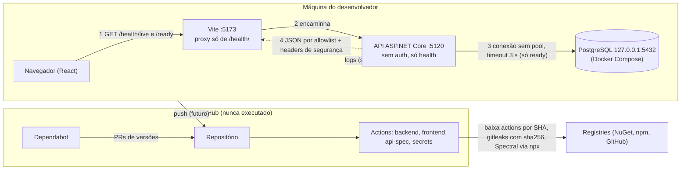

# Modelo de ameaças da Foundation

- **Revisão:** 2026-10-09. Próxima revisão: no início da etapa 2 (primeira feature com permissão e URL fornecida
  por usuário) e a cada trimestre.
- **Método:** inventário de dados → DFD → STRIDE → mitigação → teste que a garante (SA cap. 2.2 e 12.1, conforme
  `~/.claude/knowledge/api-security.md` §1). Regra de leitura: ameaça mitigada aponta para o **nome exato** do teste ou
  para o passo de CI; sem teste fica marcada **"sem teste — pendente"**; risco que se decidiu não tratar fica
  **"aceito"** com motivo.
- **Estado dos testes:** os testes abaixo existem na working tree, ainda **não commitada**, e foram escritos para a
  entrega atual. Os passos de CI citados **nunca foram executados** (o repositório não tem remote; ver
  [acceptance.md](../acceptance.md)).

## Escopo

Superfície da Foundation, e só ela:

- API ASP.NET Core com `GET /health/live`, `GET /health/ready` e, só em Development, `GET /openapi/{documentName}.json`.
  Sem autenticação, sem dados de negócio, sem entidades nem migrations.
- PostgreSQL local (Docker Compose, porta publicada só em `127.0.0.1`).
- Frontend React servido pelo Vite, que encaminha apenas `/health/` para a API (sem CORS).
- Cadeia de entrega: repositório, GitHub Actions (jobs backend, frontend, api-spec e secrets) e Dependabot.

Fora do escopo (não existe): identidade, organizações, sites, coletor, worker, nuvem. Ver
"Ameaças das próximas etapas".

## Inventário de dados

| Dado | Onde está | Quem vê | Observação |
|---|---|---|---|
| Dados de usuário ou de negócio | Em lugar nenhum | Ninguém | Não existem hoje: sem contas, sites, evidências nem PII |
| Senha do PostgreSQL | `.env` (Compose, fora do Git) e connection string em User Secrets ou `ConnectionStrings__Traceon` | Desenvolvedor; processo da API | Nunca em `appsettings*.json`, bundle, log nem resposta (testes na tabela abaixo) |
| Connection string (host, porta, usuário) | Memória da API | Processo da API | Não sai nas respostas nem nos logs de falha da readiness |
| Estado de saúde (`Healthy`/`Unhealthy`, nome do check `database`) | Resposta de `/health/*` | Qualquer cliente que alcance a API | Público por design (ADR 0004); é o único dado exposto |
| Logs (console da API) | stdout do processo | Quem opera o processo | Contêm `traceId` e, no 500, a mensagem completa da exceção (risco R3) |
| Spec OpenAPI | `docs/api/openapi.json` (Git) e `/openapi/v1.json` (Development) | Quem lê o repositório | Descreve só as duas rotas de health |
| Segredos de CI | Nenhum configurado | n/a | Jobs com `permissions: contents: read` e `persist-credentials: false` |

Endpoints mais sensíveis: nenhum manipula dado sensível. O mais caro é `GET /health/ready`, que abre uma conexão
real com o banco a cada chamada (risco R1).

## DFD

Fronteiras de confiança: navegador × Vite/API; API × PostgreSQL; repositório × CI × registries. Fluxos fáceis de
esquecer: o log (sai do processo), a CI (baixa código de terceiros) e a spec (mapa da superfície).

## STRIDE

Legenda da coluna "Garantia": nome de teste = `Classe.Metodo`; **CI** = passo do workflow
(`.github/workflows/ci.yml`); **revisão** = controle sem automação.

| # | Cat. | Ameaça | Mitigação | Garantia (teste ou controle) |
|---|---|---|---|---|
| 1 | I | Diagnóstico ou connection string vazam no corpo do health (descrição, exceção, host, porta, senha) | Resposta por allowlist (`LivenessResponse`, `ReadinessResponse`, `CheckResponse`): só status e nome do check | `HealthEndpointTests.Ready_returns_503_unhealthy_promptly_when_database_is_unreachable` (corpo exato; canário da senha, porta, `Host=`, `Exception`, `Npgsql` e ` at ` ausentes); `HealthEndpointTests.Ready_returns_healthy_database_check_when_database_is_available` e `HealthEndpointTests.Live_returns_healthy_when_database_is_available` (corpo exato) |
| 2 | I | Frontend repassa campo sensível extra, caso a API o enviasse | O parse do contrato descarta campos fora dele | `healthContract.test.ts`: "keeps only the contract fields when the body has extra ones" |
| 3 | I | Erro 500 ou 404 vaza stack, SQL, classe ou connection string | `AddProblemDetails` + `UseExceptionHandler` + `UseStatusCodePages`: corpo genérico com `traceId` | `UnhandledExceptionTests.Unhandled_exception_returns_generic_500_problem_details_with_trace_id` (live e ready; exceção com canário, `Npgsql`, `Host=`, ` at ` e `Traceon.` não aparece no corpo); `HttpPipelineTests.Unknown_route_returns_problem_details_without_internal_details` |
| 4 | I | Configuração inválida derruba o app repetindo a connection string na mensagem | `DatabaseOptions` com `ValidateOnStart`; a mensagem nomeia a chave, nunca o valor | `StartupConfigurationTests.App_fails_to_start_with_malformed_connection_string_without_echoing_it`; `StartupConfigurationTests.App_fails_to_start_without_connection_string` (ausente, vazia, só espaços) |
| 5 | I | Senha do banco aparece em log quando a readiness falha | A sonda não loga nada: a falha vira exceção e o `HealthCheckService` a registra (nome do check e exceção do Npgsql, sem a senha); a sonda não interpola a connection string em mensagem alguma | `HealthEndpointTests.Ready_failure_logs_never_contain_the_database_password` (banco recusando e mudo) |
| 6 | I | Resposta de health é cacheada e mostra estado velho (ou ficaria em cache compartilhado) | `Cache-Control: no-store` por filtro do grupo `/health` | `HealthEndpointTests.Health_responses_are_uncacheable_json`; contrato do header em `OpenApiDocumentTests.Health_operation_documents_its_identity_and_json_responses` |
| 7 | I/T | Clickjacking, MIME sniffing e referrer vazando em respostas da API | `X-Content-Type-Options: nosniff`, `Referrer-Policy: no-referrer`, `X-Frame-Options: DENY`, `Content-Security-Policy: default-src 'none'; frame-ancestors 'none'`, via `Response.OnStarting` (vale também no 500) | `SecurityHeadersTests.Responses_carry_security_headers` (live 200, ready 503, rota inexistente 404); `SecurityHeadersTests.Unhandled_exception_response_keeps_security_headers` (o handler limpa os headers antes de escrever o 500). **Lacuna:** a página do frontend (servida pelo Vite) não tem esses headers; fica para a hospedagem (etapa 6, ver R5) |
| 8 | S/E | Rota ou método não previstos (endpoint esquecido, `POST` em health, ghost API) | Health só em `MapGet`; outros métodos → 405 Problem Details com `Allow: GET`; inventário de rotas como fitness function; spec lista só as duas operações | `RouteInventoryTests.Registered_routes_are_exactly_the_public_allowlist` (Testing e Production); `RouteInventoryTests.Development_adds_only_the_openapi_document_to_the_allowlist`; `HealthEndpointTests.Health_endpoints_reject_other_methods_with_405_problem_details`; `OpenApiDocumentTests.Document_lists_exactly_the_two_health_get_operations` |
| 9 | I | Spec OpenAPI exposta em produção revela a superfície | `MapOpenApi` só em Development | `HttpPipelineTests.OpenApi_document_is_exposed_only_in_development` |
| 10 | T | Spec versionada diverge do código (contrato muda sem revisão) | O build regrava `docs/api/openapi.json`; a CI falha se houver diferença ou arquivo não versionado | CI: passo "Verificar drift da spec OpenAPI" (job backend); lint da spec: job `api-spec` (Spectral + owasp-ruleset). Ambos nunca executados |
| 11 | S/E | Falsa sensação de autenticação: alguém assume que a API é protegida | Não há autenticação, e nenhuma rota além de health existe; health é anônimo por design (ADR 0004); o Spectral tem `overrides` só para os dois paths de health, então rota nova sem `security` falha o lint | `RouteInventoryTests.*` (nenhuma rota fora da allowlist). Na etapa 2 o inventário passa a exigir 401 sem credencial (ver "Ameaças das próximas etapas") |
| 12 | T | Resposta adulterada ou inesperada confundida com estado válido no painel | O frontend trata o corpo como `unknown`, valida o contrato e cai em "resposta inesperada" | `healthContract.test.ts`: "rejects %s" (13 corpos inválidos); `http.test.ts`: "reports a body that is not JSON as invalid" e "reports JSON that the parser rejects as invalid" |
| 13 | I | Banco exposto na rede | Compose publica a porta só em `127.0.0.1`; senha obrigatória, sem padrão (`${POSTGRES_PASSWORD:?...}`) | **Sem teste — pendente** (controle de configuração em `compose.yaml`, só desenvolvimento local; produção é etapa 6) |
| 14 | I | Segredo commitado (senha, connection string, `.env`) | `.env` no `.gitignore` (`.env.example` sem segredo); User Secrets em dev; gitleaks sobre o histórico completo, binário com versão e sha256 fixos | CI: job `secrets` ("Procurar segredos no histórico"), nunca executado. `ConnectionStrings` fora de `appsettings*.json` por revisão |
| 15 | I | Segredo no bundle do frontend | `TRACEON_API_URL` sem prefixo `VITE_`, lida só pelo `vite.config.ts`; nenhum valor sensível no frontend (ADR 0006) | **Sem teste — pendente** (revisão; um teste do bundle é candidato quando houver segredo possível) |
| 16 | T/E | Supply chain: action, pacote ou imagem comprometidos ou trocados | Actions fixadas por SHA com a versão em comentário; pacotes NuGet e npm em versão exata (`Directory.Packages.props`, `.npmrc` `save-exact`), `npm ci`; imagem `postgres:18.6-alpine3.24` sem `latest`; `permissions: contents: read`; `persist-credentials: false`; idade mínima de 2 semanas aplicada à mão (ADR 0003); Dependabot semanal sem major | CI: `dotnet restore` (falha se `<PackageReference>` tiver `Version`), `npm ci` (falha se o lockfile divergir), checksum do gitleaks. `.github/dependabot.yml` nunca validado pelo GitHub. Política de SHA e idade mínima: **revisão de PR, sem automação**. Lacunas em R4 |
| 17 | D | Abuso de `GET /health/ready`: cada chamada abre uma conexão real sem pool e pode esgotar `max_connections` ou segurar workers | Limite atual: a sonda tem timeout de 3 s e fecha a conexão; health sem dado, sem autenticação | Timeout garantido por `HealthEndpointTests.Ready_returns_503_unhealthy_promptly_when_database_is_unreachable` (banco mudo responde 503 dentro da margem de 10 s para o limite de 3 s). **Sem rate limit: risco aceito (R1)** |
| 18 | D | Banco lento ou mudo trava a API | Timeout de 3 s na sonda; liveness não consulta o banco | `HealthEndpointTests.Live_returns_healthy_when_database_is_unreachable` (recusando e mudo); teste acima para a readiness |
| 19 | R | Ação sem autoria (repudiation) | Não há ação de usuário nem de negócio; cada resposta de erro traz `traceId` e o log do 500 usa o mesmo id | `UnhandledExceptionTests.Unhandled_exception_is_logged_with_the_trace_id_returned_to_the_client`. Trilha de auditoria de ações de usuário: módulo Audit, etapa 5 |

## Riscos aceitos e pendências

| # | Risco | Situação | Decisão |
|---|---|---|---|
| R1 | DoS por chamadas repetidas a `/health/ready` (conexão real por chamada, sem pool, sem rate limit) | **Aceito na Foundation.** Mitigação parcial: timeout de 3 s. Sem limite por IP nem cache do resultado. As regras OWASP `api4:2023-rate-limit*` estão desligadas só para os paths de health no `.spectral.yaml`, com este motivo | **Decisão pendente** na etapa 2 (rate limit de login, mesma infraestrutura) e etapa 6 (limite no reverse proxy/Azure). Se health ganhar limite ou cache, as duas regras voltam para esses paths |
| R2 | `AllowedHosts: "*"` (qualquer `Host` é aceito) | **Aceito:** só desenvolvimento local, sem links gerados a partir do host | Fechar na etapa 6, com o domínio real |
| R3 | O log do 500 guarda a mensagem completa da exceção (o teste de correlação semeia canário nela). Se uma exceção futura carregar segredo ou PII na mensagem, ele vai ao log | **Aceito na Foundation:** hoje não há dado sensível nem fonte de PII, e o log não sai da máquina | Revisar na etapa 2, junto com a allowlist de campos de log e o canário de vazamento em logs de requisições com dado de usuário |
| R4 | Supply chain com lacunas: (a) as versões do Spectral na CI (`SPECTRAL_CLI_VERSION`, `SPECTRAL_OWASP_RULESET_VERSION`) são exatas, mas ficam num `env:` do workflow, **fora do Dependabot**; (b) o `npx` do job `api-spec` resolve dependências transitivas do registry sem lockfile nem hash; (c) NuGet também sem lockfile (ADR 0003) | **Aceito**, com atualização manual das duas versões | Reavaliar se o Spectral virar dependência do repositório (`package.json` com lockfile) |
| R5 | Headers de segurança e CSP só existem na API; o HTML do frontend não os tem. HSTS inexistente (HTTP local). `servers` por ambiente ausentes na spec. CORS × reverse proxy não decidido | **Aceito:** a hospedagem ainda não existe | Etapa 6: CSP do frontend na hospedagem, HSTS, `servers`, decisão de CORS |
| R6 | A CI, o gitleaks e o Dependabot nunca rodaram; os controles 10, 14 e 16 estão **configurados, não comprovados** | Pendente | Validar no primeiro push autorizado |

## Ameaças das próximas etapas

Não implementadas; registradas para que a etapa não comece sem o controle.

- **SSRF do coletor (etapa 3).** O coletor busca URLs fornecidas pelo usuário, o vetor típico de SSRF (SA 5.2–5.3).
  Antes de qualquer coleta externa o prompt mestre exige autorização do site, este modelo e controles na
  **aplicação e na rede**: (1) perguntar se a feature precisa de cada URL (eliminar antes de mitigar); (2) allowlist de
  destino, ou bloqueio de loopback, redes privadas, link-local e metadata (`169.254.169.254`) **depois** de resolver o
  DNS, fixando o IP resolvido na conexão (evita DNS rebinding); (3) redirecionamentos desligados ou revalidados a cada
  salto; (4) **sub-recursos** (scripts, imagens, iframes que a página carrega) passam pelo mesmo filtro; (5) limite de
  tempo, de tamanho de resposta e de profundidade; (6) isolamento de rede do coletor (sem rota para o banco nem para a
  rede interna). Testes exigidos: `127.0.0.1`, `[::1]`, `169.254.169.254`, `10.x`, IP decimal, DNS que resolve para IP
  interno e redirect para interno são rejeitados.
- **Isolamento entre organizações (etapa 2).** Toda leitura, escrita e remoção filtra por id **e** organização na
  query; recurso de outra organização responde 404, sem dado alheio no corpo e com o recurso intacto. Teste A × B em
  cada rota. O `RouteInventoryTests` passa a exigir 401 sem credencial para tudo que não estiver na allowlist pública.
- **Conteúdo externo não confiável (etapas 3 e 4).** HTML, scripts, headers e texto coletados são dado, nunca
  instrução: validados contra schema, limitados em tamanho, renderizados sem interpretação (sem `dangerouslySetInnerHTML`),
  e nunca entram em prompt, log nem comando como confiáveis.
- **Controles de API da etapa 2** (detalhe em [progress.md](../progress.md)): DTO estrito, rate limit, `ETag`/`If-Match`,
  fuzzing (Schemathesis), `oasdiff breaking` e schema de erro com `errors[]`.

Decisões e convenções que sustentam esta tabela: [ADR 0007](../adr/0007-convencoes-de-api-e-seguranca-da-foundation.md)
e [ADR 0004](../adr/0004-health-checks-liveness-e-readiness.md).
